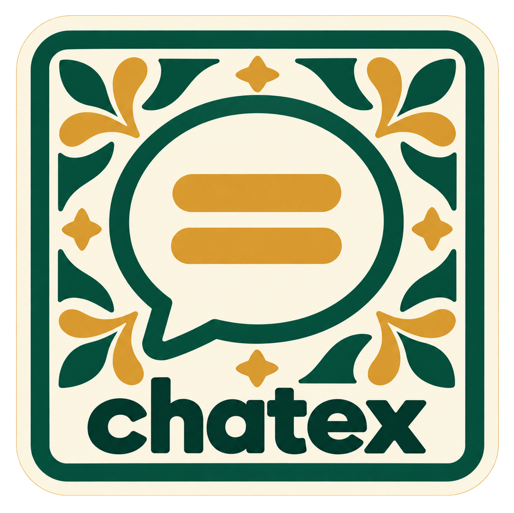

<p align="center">
  
  <br />
  <!-- repo-tagline:start -->
  <strong>💬 Follow conversations with live captions 👥</strong>
  <!-- repo-tagline:end -->
</p>

Chatex is a mobile web app for deaf people and their friends to follow conversations through shared live captions. Open [the app](https://chatex.tsilva.eu) on each participant’s phone to read named captions and send typed replies. Transcription supports multiple languages, including Portuguese as spoken in Portugal.

Enter your name, create a room, and share its QR code or invitation link. Once at least two people have joined, the host starts the conversation. Each speaking phone supplies its own microphone stream; participants can also read and type without microphone access.

## Install

For local development, use Node.js 22 or newer and pnpm 10.33.0. Clone the repository and preview the frontend:

```bash
git clone https://github.com/tsilva/chatex.git
cd chatex
pnpm install --frozen-lockfile
pnpm build
node scripts/serve.mjs --port auto
```

Open the URL printed by the server. To enable local rooms and transcription, follow the [local backend setup](docs/room-deployment.md#local-development); it connects the frontend to a local Worker with an OpenAI API key and the correct allowed origin.

## Commands

```bash
pnpm typecheck    # check the Worker’s TypeScript
pnpm test:rooms   # test rooms and audio with an isolated mock provider
pnpm build        # build the frontend into dist/
```

## Notes

- Rooms support 2–6 participants, expire after one hour, and delete captions when ended or expired. The current deployment allows ten new rooms per UTC day.
- Keep the page open and visible. Microphone capture requires HTTPS or localhost and browser permission; a page reload requires activating the microphone again.
- Names identify source phones. Nearby voices, music, and overlapping speech can cause incorrect captions or attribution. Voice profiles and single-phone diarization are deferred; a real multi-phone conversation trial remains necessary.
- Audio is streamed to the transcription provider and is not stored by the room app. The OpenAI API key stays on the server; participants need no provider credentials. Transcription incurs provider charges.
- The frontend runs on Vercel, with Cloudflare Workers coordinating rooms and forwarding audio to OpenAI. `CHATEX_API_URL` selects the backend at build time; `ALLOWED_ORIGINS` must include the frontend’s exact origin. Defaults, limits, provider adapters, and deployment commands are in the [deployment guide](docs/room-deployment.md).
- The Python/Nemotron GPU experiment is retired from the active setup. Its source is preserved in [the recovery archive](archive/diarization-spike/README.md); current development and deployments use the OpenAI-backed Worker.
